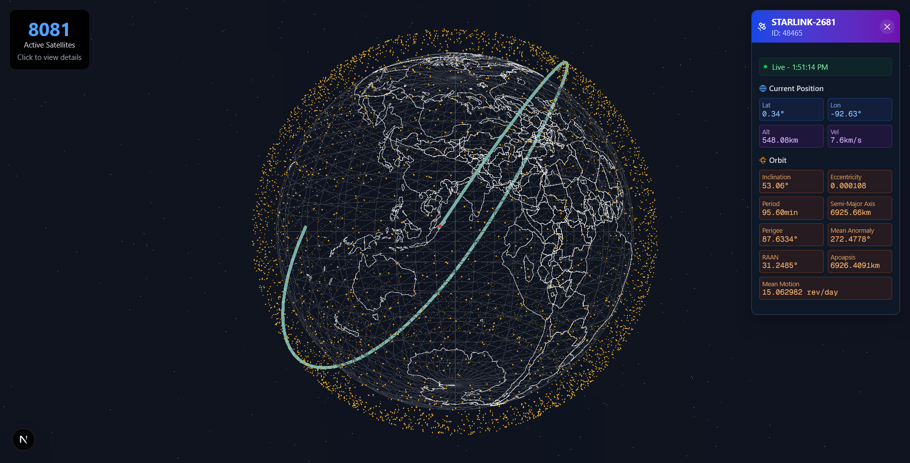

# Satellite Tracking Visualization



Real-time 3D visualization of Earth with live Starlink satellite positions using Three.js and Next.js.

## Features

- 🌍 Interactive 3D Earth rendering with cloud animations
- 🛰️ Live satellite positions updated from NORAD data
- 📊 Detailed satellite information panels
- 🔍 Multiple visualization modes (political/geographical)
- ⚡ Real-time data updates

## Installation

1. Clone repository:

```bash
git clone https://github.com/yourusername/satellite-tracker.git
```

2. Install dependencies:

```bash
npm install
```

3. Run development server:

```bash
npm run dev
```

Open [http://localhost:3000](http://localhost:3000) with your browser to see the application.

## Data Sources

- Satellite TLE Data: [CelesTrak](http://celestrak.org/NORAD/elements/)
- GeoJSON Boundaries: [Natural Earth GeoJSON](https://github.com/martynafford/natural-earth-geojson)

## Technologies

- Next.js
- Three.js
- React Three Fiber
- TypeScript
- Tailwind CSS

## Project Structure

- `/public/TLE` - Contains satellite TLE data files
- `/public/geojson` - Contains Earth boundary GeoJSON files
- `/public/textures` - Earth texture maps for day, night, and clouds
